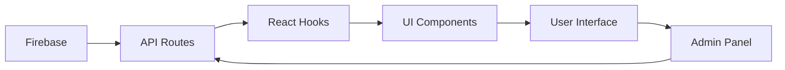

# 📱 Sistema de Widgets Sociales

## 🎯 Descripción General

El sistema de widgets sociales permite mostrar automáticamente reels de Facebook e Instagram en la página principal del sitio web, con efectos de animación al hacer scroll y gestión completa desde el panel de administración.

## ✨ Características Principales

### 🎨 Frontend
- **Posicionamiento Inteligente**: Los widgets se posicionan automáticamente en diferentes ubicaciones de la página
- **Animaciones Scroll**: Aparecen con efectos suaves cuando el usuario hace scroll
- **Rotación Visual**: Cada widget tiene una rotación única para crear un efecto dinámico
- **Hover Effects**: Efectos interactivos al pasar el mouse
- **Responsive Design**: Adaptado para móviles y desktop
- **Indicadores Visuales**: Badges con números de posición y estado de carga

### 🔧 Backend
- **Firebase Integration**: Almacenamiento en Firestore con sincronización en tiempo real
- **API REST Completa**: Endpoints para CRUD operations (GET, POST, PUT, DELETE)
- **Validación de Datos**: Verificación de URLs y tipos de contenido
- **Error Handling**: Manejo robusto de errores y estados de carga
- **Hooks Personalizados**: React hooks para gestión de estado y datos

### 👥 Panel de Administración
- **Gestión Visual**: Interfaz intuitiva para administrar widgets
- **Activar/Desactivar**: Control de visibilidad individual por widget
- **Edición en Tiempo Real**: Cambios se reflejan inmediatamente en la web
- **Validación de URLs**: Verificación automática de enlaces válidos
- **Posicionamiento**: Control de orden y ubicación de widgets

## 🏗️ Arquitectura del Sistema

### 📁 Estructura de Archivos

```
components/
├── home/
│   └── SocialWidgets.tsx          # Componente principal de widgets
├── admin/
│   └── SocialWidgetsManager.tsx   # Panel de administración
└── ui/
    └── BackButton.tsx             # Navegación

lib/
├── hooks/
│   └── useFirebaseData.ts         # Hook personalizado para widgets
└── firebase/
    └── config.ts                  # Configuración Firebase

app/
├── api/
│   └── social-widgets/
│       └── route.ts               # API endpoints REST
└── page.tsx                       # Integración en homepage

scripts/
├── create-social-widgets.js       # Script de inicialización
└── create-social-widgets-client.js # Cliente Firebase

types/
└── index.ts                       # Definiciones TypeScript
```

### 🔄 Flujo de Datos



## 🚀 Instalación y Configuración

### 1. Dependencias Instaladas
```bash
npm install react-social-media-embed
```

### 2. Firebase Collections
- **Colección**: `socialWidgets`
- **Estructura**:
```typescript
interface SocialWidget {
  id: string
  type: 'facebook' | 'instagram'
  url: string
  position: number
  active: boolean
  createdAt: Date
  updatedAt: Date
}
```

### 3. Script de Inicialización
```bash
node scripts/create-social-widgets-client.js
```

## 📱 Uso del Sistema

### Para Administradores

1. **Acceder al Panel**:
   - Ir a `/dashboard/admin`
   - Seleccionar "Redes Sociales"

2. **Agregar Widget**:
   - Clic en "Agregar Widget"
   - Seleccionar tipo (Facebook/Instagram)
   - Pegar URL del reel/post
   - Definir posición
   - Activar/desactivar

3. **Gestionar Widgets**:
   - Ver lista de widgets existentes
   - Activar/desactivar con un clic
   - Eliminar widgets no deseados
   - Ver preview de URLs

### Para Usuarios Finales

1. **Visualización**:
   - Los widgets aparecen automáticamente en la página principal
   - Se activan con animaciones al hacer scroll
   - Posiciones fijas pero visualmente dinámicas

2. **Interacción**:
   - Hover effects al pasar el mouse
   - Clic para ver contenido completo
   - Responsive en móviles

## 🔧 API Endpoints

### GET `/api/social-widgets`
Obtener todos los widgets activos ordenados por posición.

**Response**:
```json
{
  "widgets": [
    {
      "id": "widget1",
      "type": "facebook",
      "url": "https://facebook.com/reel/...",
      "position": 1,
      "active": true,
      "createdAt": "2024-01-01T00:00:00Z",
      "updatedAt": "2024-01-01T00:00:00Z"
    }
  ]
}
```

### POST `/api/social-widgets`
Crear nuevo widget social.

**Request Body**:
```json
{
  "type": "facebook",
  "url": "https://facebook.com/reel/123",
  "position": 1,
  "active": true
}
```

### PUT `/api/social-widgets`
Actualizar widget existente.

**Request Body**:
```json
{
  "id": "widget1",
  "active": false
}
```

### DELETE `/api/social-widgets`
Eliminar widget.

**Request Body**:
```json
{
  "id": "widget1"
}
```

## 🎨 Personalización de Animaciones

### CSS Classes Principales
```css
/* Animación de entrada */
.opacity-0.translate-y-20 -> .opacity-100.translate-y-0

/* Rotaciones disponibles */
.rotate-1, .rotate-2, .rotate-3
.-rotate-1, .-rotate-2, .-rotate-3

/* Efectos hover */
.hover:scale-105.hover:rotate-0

/* Posicionamiento */
.left-4, .right-4, .left-1/2
```

### Configuración de Animaciones
```typescript
// Delay staggered
setTimeout(() => setIsVisible(true), index * 200)

// Intersection Observer
{
  threshold: 0.1,
  rootMargin: '50px 0px'
}
```

## 📊 Monitoreo y Debugging

### Logs del Sistema
- API requests en Network tab
- Firebase operations en Console
- Component rendering en React DevTools

### Estados de Error
- Loading states con spinners
- Error boundaries para fallos
- Fallback content para URLs inválidas

### Performance
- Lazy loading de componentes
- Intersection Observer para scroll
- Debounced API calls

## 🔒 Seguridad

### Validaciones
- URL format validation
- Content type verification
- User permission checks
- Rate limiting en API

### Firebase Rules
```javascript
// Firestore Security Rules
match /socialWidgets/{widgetId} {
  allow read: if true;
  allow write: if request.auth != null && 
    request.auth.token.role in ['admin', 'it'];
}
```

## 🚀 Deployment

### Variables de Entorno Requeridas
```bash
# Firebase Config
NEXT_PUBLIC_FIREBASE_API_KEY=...
NEXT_PUBLIC_FIREBASE_AUTH_DOMAIN=...
NEXT_PUBLIC_FIREBASE_PROJECT_ID=...
NEXT_PUBLIC_FIREBASE_STORAGE_BUCKET=...
NEXT_PUBLIC_FIREBASE_MESSAGING_SENDER_ID=...
NEXT_PUBLIC_FIREBASE_APP_ID=...
```

### Build Process
1. `npm run build` - Compilar aplicación
2. `npm run start` - Servidor de producción
3. Deploy to Vercel/Firebase Hosting

## 📈 Métricas y Analytics

### KPIs Recomendados
- Engagement rate de widgets
- Click-through rate a redes sociales
- Tiempo de permanencia en página
- Conversiones desde widgets

### Tracking Events
```javascript
// Ejemplo de tracking
gtag('event', 'social_widget_click', {
  widget_type: 'facebook',
  widget_position: 1,
  page_location: window.location.href
})
```

## 🛠️ Troubleshooting

### Problemas Comunes

#### Widgets no aparecen
1. Verificar Firebase connection
2. Revisar console errors
3. Verificar URLs públicas
4. Comprobar estado activo

#### Animaciones no funcionan
1. Verificar Intersection Observer support
2. Revisar CSS classes
3. Comprobar JavaScript errors

#### Panel de admin no carga
1. Verificar permisos de usuario
2. Revisar Firebase rules
3. Comprobar API endpoints

### Comandos de Diagnóstico
```bash
# Verificar widgets en Firebase
firebase firestore:get socialWidgets

# Logs del servidor
npm run dev

# Test API endpoints
curl -X GET http://localhost:3000/api/social-widgets
```

## 📞 Soporte

Para problemas o mejoras del sistema de widgets sociales:

1. **Documentación**: Revisar este archivo
2. **Issues**: Crear ticket en repositorio
3. **Contact**: Administrador de sistema

## 🔄 Roadmap Futuro

### Próximas Características
- [ ] Soporte para TikTok videos
- [ ] Instagram Stories integration
- [ ] Analytics dashboard
- [ ] A/B testing framework
- [ ] Advanced positioning controls
- [ ] Video thumbnails preview
- [ ] Batch upload functionality
- [ ] Scheduled publishing

---

*Sistema implementado con ❤️ para optimizar la presencia en redes sociales*
